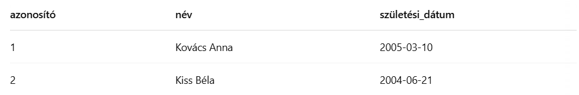

<h2>A relációs adatmodell. Relációséma, reláció. Relációk tulajdonságai, az attribútumok értéktartománya. Kulcsok, indexek.</h2>

A relációs adatmodell az egyik legelterjedtebb adatbázis-szervezési forma, amely táblákban tárolja az információkat. A tábla szerkezetét a relációséma határozza meg, míg a reláció maga a táblázatban szereplő adatsorokat jelenti. Minden relációnak megvannak a tulajdonságai: például a sorok egyediek, a sorrend nem számít, és az oszlopok meghatározott adattípusú értékeket tartalmaznak. A kulcsok, különösen az elsődleges és idegen kulcsok, segítenek az adatok összekapcsolásában és egyediségének biztosításában. Az indexek segítségével a lekérdezések gyorsabban futnak le, ezért ezek kulcsfontosságúak a teljesítmény szempontjából.

**Mi az a relációs adatmodell?**
A relációs adatmodell egy matematikai alapokon nyugvó adatábrázolási forma, amely táblákban (relációkban) tárolja az adatokat.
Ezt a modellt E. F. Codd dolgozta ki az 1970-es években. A relációs módell egyszerű, de nagyon hatékony: minden adat táblázatos szerkezetű, ahol sorok és oszlopok vannak.

**Relációséma és reláció**
Relációséma: A tábla **szerkezete**, azaz az oszlopok neve és adattípusa. Olyan, mint egy „tervrajz”.
Reláció: A tábla konkrét **tartalma**, azaz a benne szereplő sorok (rekordok).

Példa relációséma:
```sql
DIÁK(azonosító: INTEGER, név: VARCHAR(100), születési_dátum: DATE)
```

Példa reláció: <br>



**A reláció tulajdonságai**
1. Sorok sorrendje nem számít - a reláció halmazként viselkedik.
2. Oszlopok sorrendje sem számít, csak a nevük fontos.
3. Minden sor egyedi kell, hogy legyen - nincs duplikált sor.
4. Minden mezónek pontos értéke van (vagy NULL) - nincs tömb, nincs beágyazott tábla

**Attribútumok értéktartománya (domain)**
Az attribútum egy oszlop a relációban, amely egy bizonyos típusú adatot tárol. Az értéktartomány (domain) azt jelenti, hogy milyen típusú és milyen szabályoknak megfelelő értékek kerülhetnek ide.

*Példa:*

- név: VARCHAR(100) → csak max. 100 karakteres szöveg
- jegy: INTEGER CHECK (jegy BETWEEN 1 AND 5) → csak 1–5 közötti számok

A domain segít az adatintegritás megőrzésében.


**Kulcsok (Keys)**
A kulcsok biztosítják, hogy minden rekord egyedileg azonosítható legyen.

*Kulcstípusok*
1. Elsődleges kulcs (Primary key): Egyedi azonosító, Nem lehet NULL, nem lehet ismétlődő
2. Idegen kulcs (Foreign key): Egy másik tábla kulcsára hivatkozik. Kapcsolatok megvalósítására szolgál (néha külső kulcs)
3. Kandidatív kulcs (Candidate key): Olyan attribútum(ok), amelyek alkalmasak lennének elsődleges kulcsnak
4. Kompozit kulcs: Több oszlopból álló kulcs (pl. tanulo_id + tantargy_id)


**Indexek**
Az indexek olyan adatstruktúrák, amelyek gyorsabb keresést és hatékonyabb lekérdezést tesznek lehetővé. olyan mint egy könyv tartalomjegyzéke - nem változtatja meg az adatokat, de megkönnyíti azok elérését.

1. B-tree index: Alapméretezett a legtöbb DBMS-ben, rendezett
2. Hash index: Gyors keresés, de csak egyenlőségvizsgálatra jó
3. Összetett index: több oszlopra épül

Fontos: túl sok index lassíthatja az írási műveleteket.