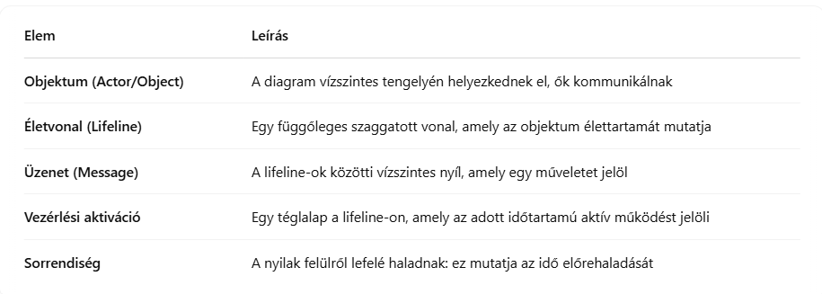
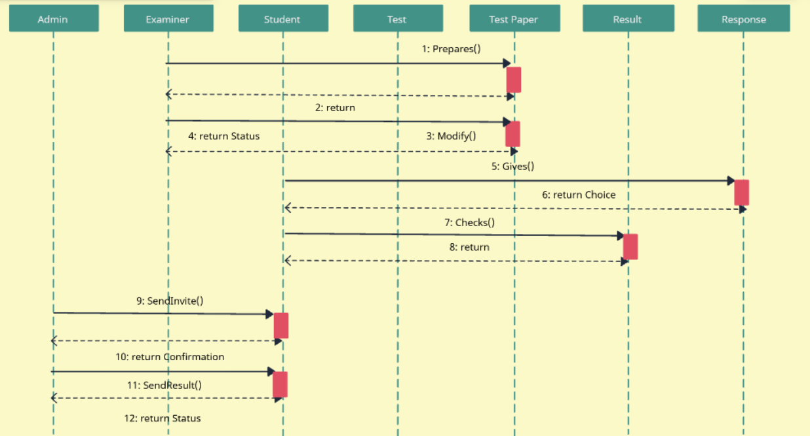

<h2>Ismertesse a sorrend diagramot (egy konkrét példa is szükséges).</h2>

Angol nyelvű oktatóanyag, hogyan kreáljunk sequence diagramot: https://creately.com/guides/sequence-diagram-tutorial/

A sorrend diagram (sequence diagram), más néven sequence diagram, **az UML viselkedési diagramjai közé tartozik**, és egy adott folyamat során az **objektumok közötti üzenetváltásokat szemlélteti időrendben**. Az objektumok vízszintesen helyezkednek el, az idő pedig fentről lefelé halad. A diagram segítségével láthatjuk, hogy az egyes objektumok mikor milyen üzenetet küldenek egymásnak, például egy bejelentkezési folyamat során hogyan kerülnek továbbításra az adatok a frontend, a backend és az adatbázis között. A sorrend diagram nagyon hasznos eszköz a fejlesztési folyamatok megértésében és a kommunikációs logika tervezésében. Átláthatóvá teszi az interakciókat és segíti a hibák korai kiszűrését.

Ez a diagram elsősorban az objektumok közötti interakciók sorrendjére fókuszál, és jól szemlélteti, hogy melyik objektum mikor és kinek küld üzenetet, valamint hogy milyen műveletek történnek egy adott forgatókönyv alapján.

<h3>Főbb elemei</h3>

<h3>Példa: Bejelentkezési folyamat</h3>

Szereplők:
- Felhasználó
- Weboldal frontend
- Backend szerver
- Adatbázis

Forgatókönyv:
1. A felhasználó beírja az adatokat
2. A frontend továbbítja az adatokat a szervernek
3. A szerver lekérdezi az adatbázist
4. Az adatbázis visszaadja az eredményt
5. A frontend megjeleníti az eredményt
6. A frontend megjeleníti az eredményt

