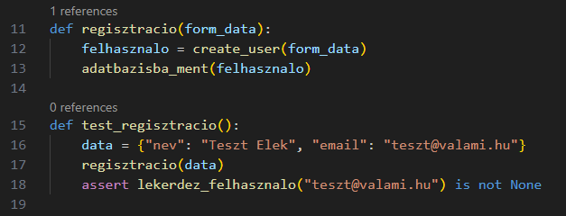
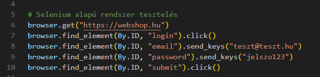
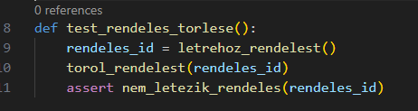
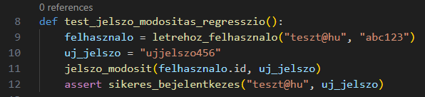
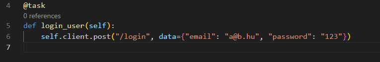

<h2>Ismertesse a dinamikus szoftvertesztelési módszereket.</h2>

A dinamikus szoftvertesztelés a szoftver viselkedését annak futtatása közben vizsgálja. Célja, hogy ellenőrizzük a program működését valós környezetben, különböző bemenetekkel és használati módokkal. A módszerei közé tartozik az egységtesztelés, ahol egy adott modul kerül vizsgálatra, az integrációs tesztelés, amely a komponensek együttműködését ellenőrzi, valamint a rendszerteszt, amely az egész alkalmazás működését méri fel. Emellett gyakori a regressziós tesztelés is, amely arra figyel, hogy a frissítések ne okozzanak hibát korábban működő funkciókban. A dinamikus tesztelés lehet manuális vagy automatizált, és általában black-box vagy white-box módszerrel történik attól függően, hogy a tesztelő ismeri-e a belső kódot.
 
 
 
**Szoftvertesztelés fogalma:**
A szoftvertesztelés a szoftverfejlesztési folyamat önálló része, ami szorosan kíséri a fejlesztés folyamatát. A szoftvertesztelés egy rendszer vagy egy program kontrollált körülmények melletti futtatása, és az eredmények kiértékelése. Feladatai közé tartozik a fejlesztők és a döntéshozók tájékoztatása, a fejlesztés állapotának mérése és a kockázatkezelés/kockázatbecslés.

A szoftvertesztelés a szoftver jellemző tulajdonságait vizsgálja, minőségbiztosítási tevékenység. Felhasználói szemszögből:"Mennyire alkalmas a felhasználó céljára? " Tesztelői szemszögből: „Mennyire egyezik a specifikációval?” A szoftverek tesztelését megtervező, végrehajtó és az eredményeket kiértékelő szakember a szoftvertesztelő, vagy tesztmérnök.

**Mi az a dinamikus tesztelés?:**
A dinamikus tesztelés a szoftver futtatásával járó tesztelési folyamat. Ez azt jelenti, hogy ténylegesen elindítjuk a programot, különféle bemeneteket adunk meg, és figyeljük a válaszokat, működést, hibákat.

*Célja:*
A szoftver viselkedésének ellenőrzése valós körülmények között
Hibák feltárása futásidőben
 

**A dinamikus tesztelés főbb metódusai.**
1. Egységtesztelés (Unit Testing): Egy-egy függvény vagy osztály viselkedésének tesztelése különállóan.
2. Integrációs teszt (Integration Testing): Több egység (modul) együttműködésének vizsgálata.
3. Rendszerteszt (System Testing): A teljes rendszer működésének ellenőrzése, a specifikáció alapján.
4. Funkcionális tesztelés: A szoftver funkcióinak tesztelése a kívánt viselkedés szempontjából.
5. Regressziós tesztelés: Azt ellenőrzi, hogy egy új módosítás nem rontotta-e el a meglévő működést.
6. Használhatósági (usability) teszt: Felhasználói szempontból vizsgálja a program működését, kezelhetőségét.
7. Teljesítmény- és terheléses tesztek: A rendszer válaszidejét, stabilitását, erőforrás-használatát méri nagy terhelés alatt.

**Két nézőpont, amiből a dinamikus tesztelés végezhető:**
1. White-box: A fejlesztő ismeri a kódot, belső működést is teszteli (pl. elágazások, ciklusok lefedése).
2. Black-box: A tesztelő nem látja a belső kódot, csak a bemenet–kimenet párokat vizsgálja.

**Automatizált vs. manuális tesztelés:**
1. Manuális: Tesztelő ember végzi kézzel- pl. egy űrlap kitöltését ellenőrzi.
2. Automatizált: Egy előre megírt script automatikusan futtatja a teszteket.(pl. pytest, JUnit, Selenium)
 
 
 
<h3>Példák tesztelési metódusokra: (Python nyelven)</h3>

1. Egységtesztelés: 
 
 

2. Integrációs tesztelés (Integration testing): 
 

3. Rendszertesztelés (System testing) 
 

4. Funkcionális tesztelés 
 

5. Regressziós tesztelés 
 

6. Használhatósági tesztelés (Usability) 
Cél: emberi tesztelők vizsgálják, mennyire intuitív a kezelőfelület.

Példa:
Felhasználó megkap egy feladatot: „Regisztrálj be egy új felhasználóként.”
Figyeljük: mennyi idő alatt találja meg a regisztrációt, kell-e segítség, hol akad el.
- Ez nem automatizált teszt, hanem valódi emberi tapasztalaton alapul.

7. Teljesítmény- és terheléses tesztelés 
 
