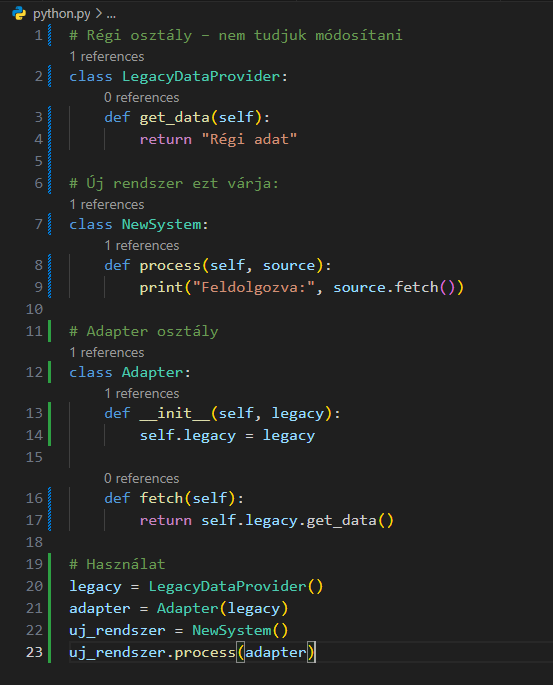

<h2>Ismertesse az Adapter tervezési mintát.</h2>

Egy programtervezési minta, amely lefordítja az egyik osztály interfészét egy kompatibilis másik interfészre. Egy *illesztő* lehetővé teszi olyan osztályok együttműködését, amelyek az inkompatibilis interface-eik miatt normálisan nem tudnának együttműködni, mindezt olyan módon, hogy interfészt nyújt a kliens számára, míg ő maga az eredeti interfacet használja. 

**Definíció (wiki):**
Az illesztő segíti két nem kompatibilis interfész együttműködését. Ez az illesztő valós életbeli definíciója. Az illesztő tervezési mintát akkor használjuk, amikor két különböző osztály nem kompatibilis interfészét szeretnénk együttműködésre bírni. Az elnevezés pusztán ennyit jelent. Az interfészek lehetnek nem kompatibilisek, de a belső funkcionalitás illeszkedik az igényekhez. Az illesztő minta lehetővé teszi a másként nem kompatibilis osztályok együttműködését azáltal, hogy konvertálja az egyik osztály interfészét a kliens által elvárt másik interfészébe.

Való életbeli példa az elmélet megértéséhez:
- laptop aksi töltő: a konnektort és a laptop akkumulátorát köti össze, ami a két összeférhetetlen "interface-t" fogja működőképessé tenni.

1. Mi az a tervezési minta?
A tervezési minták (design patterns) olyan általános, újrahasznosítható megoldások gyakori szoftvertervezési problémákra, amelyek a szoftverfejlesztés során újra és újra felmerülnek.
Nem konkrét kódrészletek, hanem sablonok, amelyeket konkrét helyzetekhez igazíthatunk.

A legismertebb csoportosítás a Gang of Four (GoF) könyvből származik, 3 fő típusba sorolva a mintákat:

- Kreációs (pl. Singleton)
- Strukturális (pl. Adapter, Decorator, Proxy)
- Viselkedési (pl. Observer, Strategy)

Az Adapter minta egy strukturális minta.

2. Mi az Adapter minta lényege?
Az Adapter minta célja, hogy összeegyeztethetetlenséget hidaljon át két osztály vagy rendszer között.
Létrehozunk egy „adapter” osztályt, amely átfordítja az egyik osztály interfészét olyanná, amit a másik elvár.

Ez a minta segít, amikor:

- Egy meglévő osztály nem illeszkedik az új rendszer elvárásaihoz.
- Egy külső könyvtár vagy régi kód nem módosítható, de használni szeretnénk.

Programozási Példa (Python)

**Statikus vs. dinamikus adapter**
- Statikus adapter (örökléssel): az adapter örökli a régi osztályt

- Dinamikus adapter (összetétellel): az adapter példányként tartalmazza a régi osztályt
→ Ez a gyakoribb, rugalmasabb megoldás

<h4>Előnyök és hátrányok</h4>

**Előnyök:**

- Meglévő kód újrahasznosítása módosítás nélkül
- Rendszerek közötti kompatibilitás biztosítása
- Modularitás és karbantarthatóság javítása

**Hátrányok:**

- Extra réteget ad a kódhoz (kissé bonyolít)
- Nem old meg minden inkompatibilitást – csak az interfészt igazítja