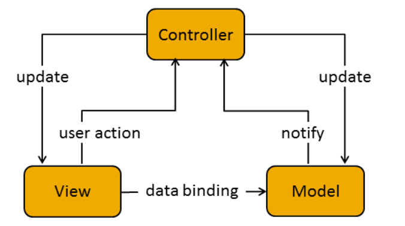
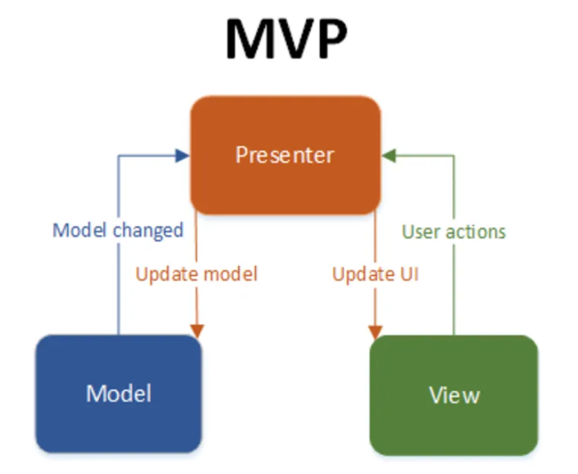

<h2>Ismertesse és hasonlítsa össze az MVC és MVP tervezési mintákat.</h2>

Miért kellenek ezek a minták?
Modern alkalmazásokban az adatkezelés, a logika és a felhasználói felület különválasztása kritikus fontosságú a kód átláthatósága, tesztelhetősége és karbantarthatósága miatt.

Az MVC (Model-View-Controller) és az MVP (Model-View-Presenter) minták strukturált módon választják szét a felelősségeket az alkalmazás különböző részei között.

Mindkettő célja:
- A logika és a megjelenítés elkülönítése
- A felületfüggetlen működés támogatása
- Tesztelhetőség és újrafelhasználhatóság javítása

1. MVC (Model-View-Controller - magyarul: Modell-Nézet-Vezérlő)

**Definíció**: egy a szoftvertervezésben használatos minta, amelyet akkor használunk ha összetett, sok adatot a felhasználó elé táró számítógépes alkalmazásokban szétválasztjuk az adathoz (modell) és a felhasználói felülethez (nézet) tartozó dolgokat, hogy a felhasználói felület ne befolyásolja az adatkezelést, és az adatok átszervezhetők legyen a felhasználói felület változása nélkül. 
Ezt a model úgy végzi, hogy elkülöníti az adatok elérését és az üzleti logikát az adatok megjelenítésétől és a felhasználói interakciótól egy közbülső összetevő, a vezérlő bevezetésével.

Az MVC minta három komponensből áll:

- **Model**: Kezeli az adatokat, üzleti logikát, pl. adatbázis-lekérdezések.
- **View**: A felhasználói felület, ami az adatokat megjeleníti.
- **Controller**: Fogadja a felhasználói eseményeket (gombnyomás, beírás), és utasítja a modellt vagy frissíti a nézetet.

🔹 Jellemző:

- A View közvetlenül kommunikálhat a Modellel, és tőle kérheti az adatokat.
- A Controller irányítja a folyamatot, de nem mindenre ő a kapuőr.

Példa (webalkalmazás):

- A felhasználó beküld egy űrlapot (View).
- A Controller feldolgozza az adatokat.
- A Model menti az adatbázisba.
- A View megjeleníti a visszajelzést.

2. MVP (Model-View-Presenter - magyarul: Modell-Nézet-Presenter)

**Definíció**: Az MVC mintából alakult ki. Olyan alkalmazásokban nyújt jelentős előnyöket, ahol komplex adathalmazokon kell műveleteket végezni, és ezek eredményeit a felhasználó elé tárni. A mintát felhasználó alkalmazások a minta sajátosságaiból eredően könnyedén alávethetőek úgynevezett egységteszteknek. (Unit test)

Az MVP minta szintén három fő komponensből áll:

- Model: Ugyanaz, mint az MVC-ben – az adat és üzleti logika.
- View: Csak megjelenít, nem tartalmaz logikát. Általában egy felületre vonatkozó interfész.
- Presenter: Minden logikáért felelős, irányítja a kommunikációt a View és a Model között.

Jellemző:

- A View nem kér közvetlenül adatokat a Modeltől.
- A Presenter kezeli az összes interakciót, és az adatokat a View-n keresztül jeleníti meg.
- Könnyebben tesztelhető, mert a View felcserélhető, mockolható.

Példa (desktop app):

- A gomb megnyomása a View-ben eseményt generál.
- A Presenter meghívja a Modelt, lekéri az adatokat.
- A Presenter átadja az adatokat a View-nek megjelenítésre.

6. Mikor melyiket?

1. MVC jól működik, ha az alkalmazás sok egyszerű eseményt kezel, és nem baj, ha a View tud a Modelről.
2. MVP ajánlott, ha komplex UI logikát kell kezelni, és fontos a tesztelhetőség.