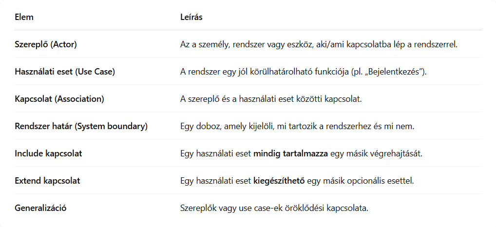
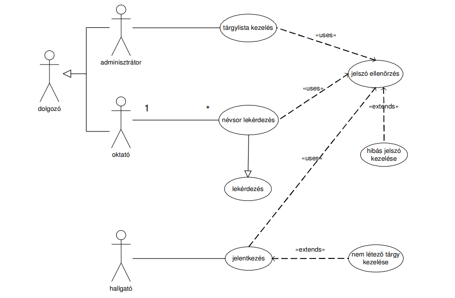

<h2>Ismertesse részletesen a használati eset diagramot és annak elemeit (egy konkrét példa is szükséges).</h2>

A **használati eset diagram** az UML egyik legfontosabb eszköze a **funkcionális követelmények modellezésére**. Ez a diagram azt mutatja meg, hogy a rendszer különböző szereplői milyen módon lépnek kapcsolatba a rendszer funkcióival. A szereplők lehetnek emberek, más rendszerek vagy eszközök, a használati esetek pedig a rendszer által biztosított funkciókat jelölik. 

Egy webáruház példáján keresztül a vásárló szereplő például böngészhet termékeket, kosárba helyezhet árukat és rendelést adhat le, míg az admin jogosult lehet felhasználók kezelésére. A diagram segíti a fejlesztőket abban, hogy jobban megértsék a rendszer elvárt működését és a felhasználók igényeit.

 

 <h3>Példa:</h3>
 <h5>Hallgatói információs rendszer</h5>

Szöveges leírás, szöveges specifikáció:
Egy olyan hallgatói információs rendszer elkészítése a cél, amelyen keresztül a
hallgatók tudnak jelentkezni a tárgyakra (a jelentkezés során a rendszernek jelezni
kell, hogy ha egy tárgy nincs meghirdetve), az oktatók lekérdezhetik a hallgatói listát,
és az adminisztrátorok tudják meghirdetni a tárgyakat. A rendszer használatához
jogosultság szükséges.

*Követelmények elemzése, definiálás*

A rendszer használói:
- Adminisztrátorok
- Hallgatók
- Oktatók

A rendszernek a következő funckiókat kell ellátnia: 
- Az adminisztrátorok tudják a tárgyakat meghirdetni.
- A hallgatók jelentkezhetnek a tárgyakra.
- Az oktatók a hallgatói listát (névsort) lekérdezhetik.
- A tárgyjelentkezés során a nem létező tárgyakat jelezni kell.
- a rendszer használatához jogosultság, azaz jelszó szükséges.

<h4>FONTOS:</h4>
Ehhez a témához fontos lehet a UML (Unified Modeling Language) fogalmának ismerete.

Az UML, azaz az Egységes Modellező Nyelv, egy grafikus eszközkészlet, amelyet szoftverrendszerek vizuális tervezésére használnak. Célja, hogy a fejlesztők, elemzők és megrendelők számára közös nyelvet biztosítson a rendszer működésének és felépítésének megértéséhez. Az UML-ben többféle diagram is létezik, mint például a használati eset diagram, amely a rendszer funkcionális követelményeit mutatja be, vagy az osztálydiagram, amely a program belső szerkezetét ábrázolja. Az UML tehát nem programozási nyelv, hanem egy vizuális kommunikációs eszköz, amely leegyszerűsíti a tervezési folyamatot.

Mire használjuk?
- Szoftverfejlesztés tervezésére
- Rendszerek dokumentálására
- Kommunikációra fejlesztők és megrendelők között
- A rendszer különböző nézeteinek (strukturális, viselkedési) bemutatására