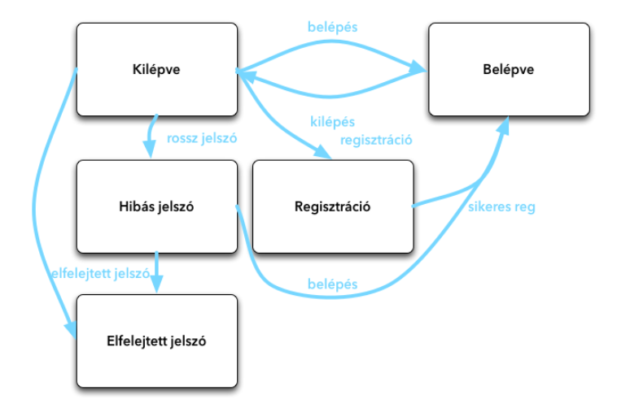

<h2>Ismertesse az állapotautomata/állapotgép diagramot (state machine) (egy konkrét példa is szükséges).</h2>

Az **állapotgép diagram** egy olyan UML típusú viselkedési diagram, amely **egy objektum vagy rendszer különböző állapotait és az ezek közötti váltásokat mutatja be**. Akkor használjuk, amikor egy entitás *viselkedése* nagyban függ attól, hogy éppen milyen *állapotban* van. A diagram ábrázolja az állapotokat, a kezdeti és végállapotot, valamint azokat az eseményeket, amelyek kiváltják az átmeneteket. Egy tipikus példa egy **webshop rendelési folyamata**, ahol a megrendelés állapota rögzítettről feldolgozás alatti, majd szállítás alatti és végül teljesített állapotba kerül. Az állapotdiagram segít jobban megérteni a rendszer működését és a logikai folyamatok felépítését.

Állapotfüggő objektumokra példa még:
- felhasználói fiók státuszai (aktivált, felfüggesztett, törölt)
- megrendelés állapotai (fogadva, feldolgozva, kiszállítva)
- gép vezérlés (bekapcsolva, kikapcsolva, hibás, stb.)

<h3>Az állapotgép diagram elemei:</h3> 
    Állapot (state): Egy konkrét állapot, amelyben az objektum lehet 
    Átmenet (transition): Az az esemény, amely egyik állapotból a másikba viszi az objektumot 
    Kezdő állapot: A diagram kezdő pontja (fekete pötty) 
    Végállapot: a rendszer működésének befejezése (koncentrikus körök) 
    Esemény: Az a trigger, amely állapotváltozást okoz 
    Őrfeltétel (opcionális): logikai feltétel, amelynek teljesülnie kell az átmenethez 

 <h3>Példa:</h3>
 <h5>Webshop megrendelés</h5>

Állapotok:
- Rögzített
- Feldolgozás alatt
- Szállítás alatt
- Teljesítve
- Törölve

Átmenetek (események):
- „Rendelés leadása” → Rögzített
- „Feldolgozás megkezdése” → Feldolgozás alatt
- „Csomag úton” → Szállítás alatt
- „Átvétel megtörtént” → Teljesítve
- „Rendelés törlése” → Törölve (bármelyik korábbi állapotból)

