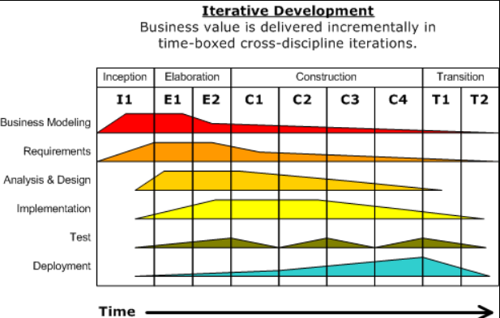
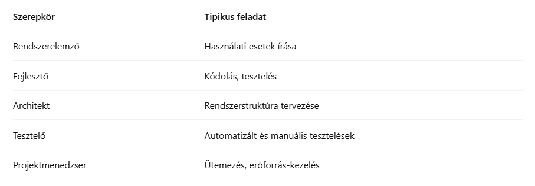
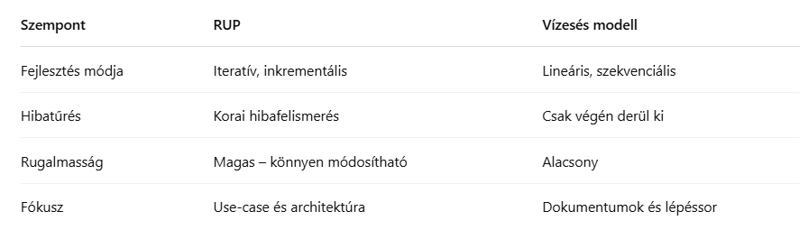

<h2>Ismertesse a RUP módszertant.</h2>

A RUP, vagyis a Rational Unified Process, egy modern szoftverfejlesztési módszertan, amely iteratív és inkrementális megközelítést alkalmaz. A módszertan célja, hogy rugalmasan alkalmazható keretet adjon a fejlesztéshez, miközben biztosítja a magas minőséget és az átláthatóságot. A RUP a fejlesztést **négy fő fázisra osztja: előkészítés, részletes kidolgozás, megvalósítás és átadás** – ezek mindegyike több iterációból állhat. A RUP fázisok és tudományágak időbeli megjelenítését RUP púpdiagramnak nevezzük. A folyamat során nagy hangsúlyt kap a *használati esetek elemzése, az architektúra kialakítása és a dokumentáció*. A klasszikus vízesés modellel ellentétben a RUP lehetővé teszi, hogy *már a fejlesztés korai szakaszában működő komponensek szülessenek*, és az igényekhez jobban alkalmazkodó rendszert építsünk.

* RUP púpdiagram (RUP-hump)

A 4 fő fázis:
1. **Előkészítés**: A projekt céljainak, költségvetésének, fő követelményeinek meghatározása.
- Az érintettek egyetértése a hatály meghatározásával és a költség / ütemterv becsléseivel.
- A követelmények megértése, amelyet az elsődleges felhasználási esetek bizonyítanak.
- A költség / ütemterv becsléseinek, prioritásainak, kockázatainak és fejlesztési folyamatának hitelesítése.
- Prototípus kifejlesztése
- Kiindulási alap létrehozása a tényleges kiadások és a tervezett kiadások összehasonlításához.- 

2.**Kidolgozás**: Architektúra kialakítása, fő komponensek, kockázatok csökkentése.
A kidolgozási szakasz eredménye:
- Olyan használati eset modell, amelyben a felhasználási eseteket és a szereplőket azonosították, és a legtöbb felhasználási eset leírást kidolgozták. A felhasználási eset modelljének 80% -ban teljesnek kell lennie.
- A szoftver-architektúra leírása a szoftverrendszer-fejlesztési folyamatában.
- Végrehajtható architektúra, amely megvalósítja felépítésében jelentős felhasználási eseteket.
- Felülvizsgált üzleti eset- és kockázatlista.
- A teljes projekt fejlesztési terve.
- Prototípusok, amelyek bizonyítottan csökkentik az egyes azonosított műszaki kockázatokat.
- Előzetes felhasználói kézikönyv (opcionális)

Ha ebben a fázisban a projekt nem felel meg minden elvárható kritériumnak, még van idő a visszavonásra, újratervezésre.

3. **Megvalósítás**: A rendszer tényleges implementálása (kódolás, tesztelés, integráció).
- Az elsődleges cél a szoftverrendszer felépítése
- Fő hangsúly a rendszer komponenseinek és egyéb tulajdonságainak fejlesztésére összpontosít 
- Ebben a szakaszban történik a kódolás nagy része. Nagyobb projektekben több építési iterációt lehet kidolgozni annak érdekében, hogy a felhasználási eseteket kezelhető szegmensekre bonthassák, és megfelelő prototípusokat állítsanak elő.

4. **Átadás**: Rendszer átadása a felhasználóknak, oktatás, finomhangolás.
- elsődleges cél a fejlesztésről a termelésre, használatra történő átvitele és a végfelhasználó számára a megértés elérése
- végfelhasználók, karbantartók képzése
- bétatesztelés a rendszerrel, hogy érvényesítsék azt a végfelhasználók elvárásaival szemben

Ha az összes cél teljesül, akkor a termék kiadási mérföldköve teljesül, és a fejlesztési ciklus befejeződik.

A RUP szerint a projektet különféle szerepkörök végzik, akik különböző tevékenységeket hajtanak végre.

 

RUP vs. Klasszikus Vízesés modell

