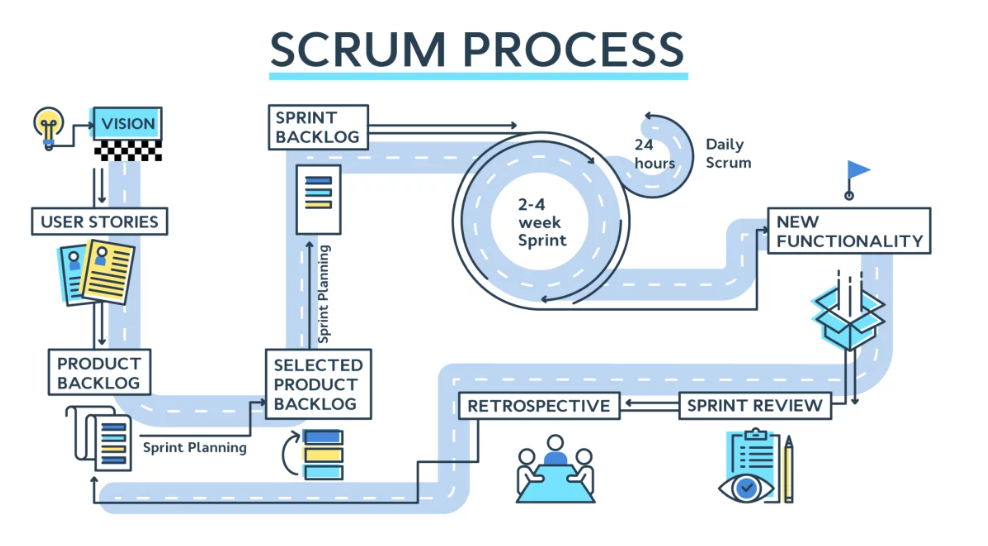

<h2>Ismertesse a Scrum módszertant.</h2>

A Scrum a legismertebb agilis módszertan, amely gyors alkalmazkodást tesz lehetővé a fejlesztési folyamat bármely szakaszában. a körülmények folyton változnak, így a fejlesztési folyamatot hatékonyan lehet adaptálni bármikor, az új feltételeknek megfelelően.
Lényege, hogy a szoftver nem egyszerre, hanem rövid szakaszokban (sprintben) készül el, és folyamatos visszajelzés alapján alakul.
A Scrum nem egy szigorúan előírt folyamat, hanem egy keretrendszer, amelyet a csapat saját igényeire szabhat.

**Jellemzői:**
- szervezetekben és csapatokban valósul meg
- a csapat által meghatározott folyamatok, technikák és módszerek együttesére támaszkodhat

**3 alappillére:**
- Átláthatóság (Transparency) - mindenki tudja, hol tart a projekt és mi készül éppen
- Ellenőrzés (Inspection) - Rendszeres visszajelzés és vizsgálat történik
- Alkalmazkodás (Adaptation) - A visszajelzések alapján módosításokat végzünk a következő ciklusban

**Szerepkörök:**
1. Product Owner (PO) - a termék víziojáért felel. Kezeli a Product Backlogot és priorizája a feladatokat
2. Scrum Mastter - A csapat mentora, a Scrum folyamat "gazdája". Segíts a csapatot a szabályok betartásában
3. Fejlesztőcsapat(Development Team) - A funkciók megvalósításáért felelős, önszervezkedő szakemberek csoportja

**Események:**
- Sprint	Egy fix hosszúságú fejlesztési ciklus (általában 1–4 hét), amely végén működő szoftver születik.
- Sprint Planning	A sprint elején történik, a csapat eldönti, mit fognak elvégezni.
- Daily Scrum (standup)	Minden nap rövid (15 perces) egyeztetés: ki mit csinált, mit csinál, van-e akadály.
- Sprint Review	A sprint végén: bemutatják az elkészült terméket, visszajelzéseket kapnak.
- Sprint Retrospective	A csapat megbeszéli, mi ment jól, min kell javítani a következő sprintben.

**Alapfogalmak:**
- Product Backlog	A teljes feladatlista, amit a termékbe fejleszteni kell. A PO felel érte.
- Sprint Backlog	A sprintre kiválasztott feladatok listája. A csapat választja ki.
- User Story	Egy felhasználói igényt leíró kis történet, amit a fejlesztők funkcióvá alakítanak.
- Definition of Done	Egy közösen meghatározott kritériumrendszer, ami alapján eldönthető, hogy valami valóban „kész” van-e.
- Burndown chart	Grafikon, amely azt mutatja, mennyi munka maradt hátra a sprintben. Segít a haladás nyomon követésében.

<h3>Példa:</h3>
Webshop fejlesztés
-> következő sprint feladat: "Kosár funkció"
-> Sprint Planning során kiválaszt -> szükséges user storyk
pl. Termék kosárba tétele, Kosár megtekintése, Termék törlése a kosárból
-> bekerülnek a Sprint Backlogba -> fejlesztők elkezdenek dolgozni rajtuk
- minden nap 10:00: Daily Scrum
Sprint végén -> funkció bemutatása PO-nak, megrendelőnek
-> Retrospective megbeszélés: min lehet javítani

