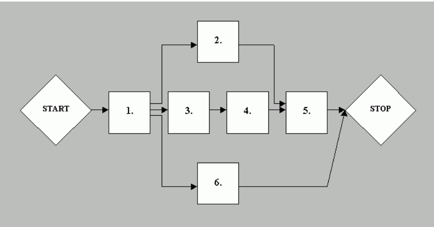

<h2>Ismertesse a tevékenység hálót és sávdiagramot (ábra szükséges mindkettőhöz). Mi a Kritikus út, és mi a jelentősége?</h2>

1. <h4>A tevékenység háló</h4> 
- (más néven hálódiagram vagy PERT-diagram) egy grafikus ábrázolási módszer, amely a projekt tevékenységeit és azok időbeli sorrendiségét, függőségeit jeleníti meg.

    A tevékenység háló egy olyan diagram, amely a projekt tevékenységeinek logikai sorrendjét és egymásra épülését mutatja be. Csomópontok és nyilak segítségével ábrázolja az egyes feladatokat és azok függőségi viszonyait. Lehetővé teszi, hogy lássuk, mely tevékenységek hajthatók végre párhuzamosan, és melyeknek kell egymás után történniük. Segít a projekt időbeli és logikai megtervezésében, valamint a kritikus út azonosításában is.

    Jellemzők:
    - A tevékenységek csomópontokat (vagy éleket alkotnak)
    - Nyilak (élek) jelzik a tevékenységek közötti kapcsolatokat, sorrendiséget
    - Az egyes tevékenységekhez hozzá lehet rendelni az időtartamot, kezdési és befejezési időpontokat

    Példaábra:

    

    1, 2, 3, 4, 5, 6 = tevékenységek

2. <h4>Sávdiagram</h4>
- (más néven Gantt-diagram) időalapú ábrázolás, ahol vízszintesen időtengely látható, és a projekt tevékenységeit sávok (bar-ok) képviselik, amelyek mutatják a kezdést, az időtartamot és végét.

    A sávdiagram egy időalapú vizuális eszköz, amely megmutatja, hogy egyes tevékenységek mikor kezdődnek és meddig tartanak. A projekt idővonalán vízszintes sávok ábrázolják a különféle feladatokat, így könnyen követhető a munkafolyamat. Hasznos az ütemezés tervezésénél és nyomon követésénél, mivel jól láthatóvá teszi az átfedéseket és a párhuzamos munkákat. A Gantt-diagram különösen népszerű a projektmenedzsmentben, mivel egyszerre áttekinthető és informatív.

    Jellemzők:
    - könnyen áttekinthető az egész projekt ütemezése
    - egyes sávok egymás után, mások párhuzamosan is futhatnak
    - jó vizuális eszköz a projekt menedzsmenthez

    Példaábra:

    

3. <h4>Kritikus út(Critical Path)</h4>
- A kritikus út a tevékenység hálóban az a leghosszabb út, amely meghatározza a projekt minimális befejezési idejét.
    (Wiki: A critical path is determined by identifying the longest stretch of dependent activities and measuring the time required to complete them from start to finish.)

    A kritikus út a projekt tevékenységei között az a leghosszabb időtartamú útvonal, amely meghatározza a projekt teljes időigényét. Az ezen az úton szereplő tevékenységek nem késhetnek, mert az közvetlenül a projekt csúszásához vezetne. A kritikus út azonosítása lehetővé teszi a hatékonyabb időgazdálkodást és az erőforrások fókuszált felhasználását. A projektvezetés szempontjából ez az egyik legfontosabb elem, hiszen segít kiszűrni a kulcsfontosságú pontokat a munkafolyamatban.

    Fontos tudnivalók:
    - A kritikus úton lévő tevékenységek nem késhetnek, mert az az egész projekt csúszásához vezetne.
    - Több út is lehet a hálóban, de csak egy a leghosszabb → ez a kritikus út.
    - A projektmenedzsment során különösen figyelni kell a kritikus útra.

    Kritikus út kiszámítása:
    - Minden tevékenységhez meghatározzuk a kezdési és befejezési időt.
    - megkeressük az összes lehetséges utat a hálóban.
    - Az útvonalak teljes időtartamát összeadjuk.
    - A legtöbb időt igénylő útvonal lesz a kritikus út.

    YT link: https://www.youtube.com/watch?v=EdZw1eQ8NWc

    Relevancia:
    - A kritikus út azonosítása segít a projektmenedzsernek az erőforrások optimális beosztásában.
    - Lehetővé teszi a kockázatok előrejelzését és a projektidő minimalizálását.
    - Fontos eszköz a projekt ütemezésének nyomon követésére.

<h3>Összefoglalás:</h3>
Tevékenység háló: Tevékenységek és kapcsolataik gráfban (logikai sorrend)
Sávdiagram: Időbeli ábrázolás tevékenységek sávjaival
Kritikus út: A projekt leghosszabb útvonala; ezen tevékenységek késése az egész projektet csúsztatja
