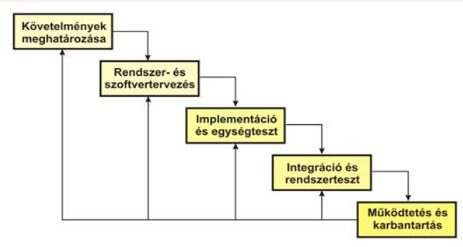
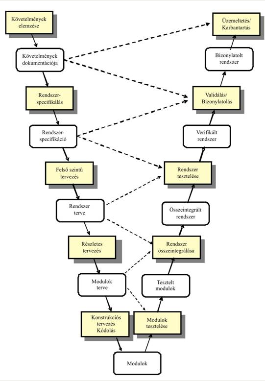
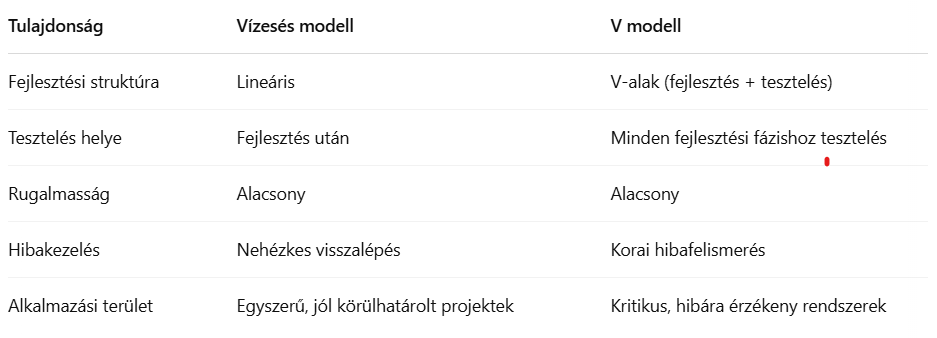

<h2>Ismertesse és hasonlítsa össze a vízesés és a V modelleket.</h2>

A vízesés modell egy klasszikus, lineáris szoftverfejlesztési megközelítés, ahol minden fázist sorban, egymás után hajtanak végre. A fejlesztés csak akkor lép tovább a következő szakaszba, ha az előző teljesen befejeződött. A V modell ehhez képest kiegészíti a vízesés modellt azzal, hogy minden fejlesztési fázishoz hozzárendel egy megfelelő tesztelési fázist is. Ez a modell a „V” betű formájában szemlélteti, hogy a verifikáció és validáció már a fejlesztés korai szakaszában elkezdődik. Míg a vízesés modell egyszerűbb és jól dokumentálható, a V modell különösen jól használható kritikus rendszerek esetén, ahol fontos a hibák időben történő kiszűrése.

1. Vízesésmodell (Waterfall-model)

    Source: https://centroszet.hu/tananyag/szervezes2/vzess_modell.html

    - A vízesés modell egy lineáris, szekvenciális szoftverfejlesztési modell.
    - A folyamat egymás után következő lépésekből áll, és minden fázist be kell fejezni, mielőtt a következő elkezdődhet.
    - Fázisai: követelményelemzés → tervezés → implementáció → tesztelés → üzembe helyezés → karbantartás.
    - A visszalépés nehézkes, ha hiba van egy korábbi lépésben.
    - Egyszerű, jól dokumentált, de nem rugalmas.

    A vízesés modell fázisai:  
        1. Követelmények elemzése és meghatározása (specifikáció)  
        2. Rendszer- és szoftvertervezés  
        3. Megvalósítás és egységteszt  
        4. Teljes rendszertesztelés  
        5. Üzemeltetés, működtetés és karbantartás  

    

2. V modell (Verification and Validation model)

    Source: https://centroszet.hu/tananyag/szervezes2/v_modell.html

    - A V modell a vízesés modell kiterjesztett változata, ahol a fejlesztési és tesztelési fázisok párokba vannak állítva.
    - A „V” alak bal oldala a fejlesztési lépéseket, jobb oldala a hozzájuk tartozó tesztelést mutatja.
    - Nagy hangsúlyt fektet a verifikációra és validációra már a fejlesztés elején.
    - Példa párok: rendszertervezés ↔ rendszer tesztelés, modultervezés ↔ egységtesztelés.
    - Csökkenti a hibák esélyét, de hasonlóan merev, mint a vízesés modell.

    

Összehasonlítás:

