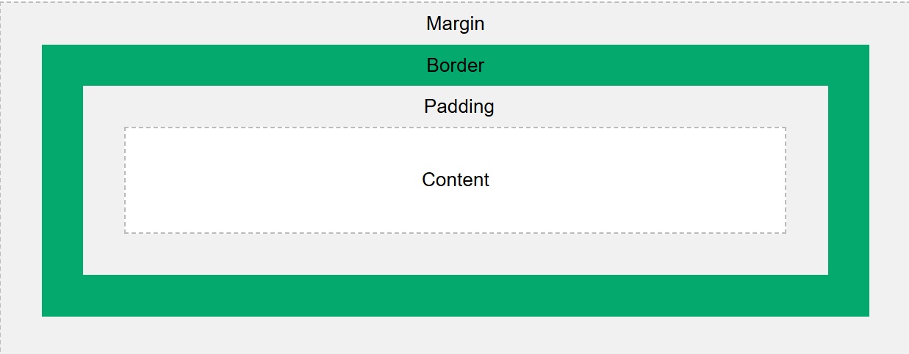

<h2>Weboldalak információtartalmának és kinézetének szétválasztása. CSS nyelvtan, kiválasztók és tulajdonságok, mértékegységek. Doboz modell, pozicionálás, megjelenítés. Fontosabb média típusok.</h2>

---

<h4>1. Tartalom és megjelenés szétválasztása</h4>

A HTML a tartalom struktúráját írja le (címek, bekezdések, képek, linkek), míg a CSS (Cascading Style Sheets) a megjelenést határozza meg (színek betűtípus, méretek, elrendezés).

**Miért jó széválasztani?**
```
Előny	                           |  Miért hasznos?
------------------------------------------------------------------------------------
Könnyebb karbantartás	           |  A dizájn változtatható a HTML érintése nélkül
Újrahasznosíthatóság	           |  Ugyanaz a CSS több HTML oldalon is használható
Elválik a „mi” és a „hogyan”	   |  Tartalom ≠ dizájn
```


<h4>2. CSS nyelvtan</h4>
A CSS szabályok így néznek ki. A hivatalos eljárás egy style.css fájl létrehozása, stylesheetként való lehivatkozása az adott oldalon és a css formatálási attribútumok listázása a ezen a fájlon, a következő képpen:

```css
szelektor {
  tulajdonság: érték;
}
```

Példa:
```css
p {
  color: blue;
  font-size: 16px;
}
```


<h4>3. Kiválasztók (selectors)</h4>

```
Típus	                   |  Példa	                      |  Mit jelöl?
-------------------------------------------------------------------------------------------------------
Elem	                   |  p	                          |  Minden <p> elem
Osztály	                   |  .doboz	                  |  Minden elem, ahol class="doboz"
Azonosító	               |  #kiemelt	                  |  Az elem, ahol id="kiemelt"
Kombinált	               |  div p, ul > li, a:hover	  |  Összetett kiválasztás, eseménykezelés
```


<h4>4. Gyakori tulajdonságok</h4>

```
Tulajdonság	           |  Jelentés
-------------------------------------------------
color	               |  Szöveg színe
background-color	   |  Háttérszín
font-size	           |  Betűméret
margin, padding	       |  Külső/belső térköz
border	               |  Szegély
width, height	       |  Méretek
display	               |  Megjelenítési mód
position	           |  Elhelyezés típusa
```


<h4>5. Mértékegységek</h4>

```
Egység	        |  Jelentés
----------------------------------------------------------------------
px	            |  Pixel (fix méret)
%	            |  Százalék (relatív)
em	            |  Az aktuális betűméret alapján
rem	            |  A gyökér (html) betűméretéhez viszonyítva
vw, vh	        |  Nézetablak szélességének / magasságának százaléka
```


<h4>6. Dobozmodell (Box Model) </h4>

Minden HTML elem egy téglalap alakú doboz. Ez a doboz 4 részből áll:




```
Rész	     |  Jelentés
------------------------------------------------
content	     |  A tartalom (pl. szöveg)
padding	     |  Belső tér a tartalom körül
border	     |  Szegély
margin	     |  Külső tér más elemek felé
```


<h4>7. Pozícionálás</h4>
A CSS pozicionálás határozza meg, hogy hol jelenik meg egy elem.

```
position érték	            |  Jelentés
----------------------------------------------------------------------------------------
static (alapértelmezett)	|  Normál elrendezés
relative	                |  Elmozdítás az eredeti helyhez képest
absolute	                |  A legközelebbi pozícionált őshöz képest helyezkedik el
fixed	                    |  Képernyőhöz rögzített (pl. menü)
sticky	                    |  Görgetés során ragad egy pozícióhoz
```

<h4>8. Megjelenítés - display értékek</h4>

```
Érték	                  |  Jelentés
---------------------------------------------------------------------
block	                  |  Új sorba kerül, teljes sort kitölt
inline	                  |  Soron belül jelenik meg
inline-block	          |  Olyan mint inline, de lehet méretezni
none	                  |  Az elem nem jelenik meg
flex, grid	              |  Modern elrendezés vezérlők
```


<h4>9. Fontosabb média típusok és média lekérdezések</h4>

@media – reszponzív tervezés
A @media szabály segítségével külön stílusokat alkalmazhatunk különböző eszközökre (mobil, tablet, monitor).

```css
@media screen and (max-width: 768px) {
  body {
    background-color: lightgray;
  }
}
```
Ezzel mobilon más szín, más méret, más elrendezés jelenhet meg!

**Összefoglalás:**
A modern weboldalak fejlesztésénél fontos szempont a tartalom (HTML) és a megjelenés (CSS) szétválasztása. Ez megkönnyíti a karbantartást, átláthatóbbá teszi a forráskódot, és lehetővé teszi a reszponzív tervezést. A CSS nyelvtana szelektorokból és tulajdonság–érték párokból áll, amelyeket HTML elemekhez rendelünk. A dobozmodell segítségével szabályozható a tartalom körüli térköz és elhelyezés. A pozicionálás (position) és megjelenítés (display) típusok segítségével változatos elrendezések hozhatók létre. A @media lekérdezések biztosítják, hogy különböző képernyőméretre külön szabályokat definiálhassunk, így a weboldal minden eszközön jól jelenik meg.